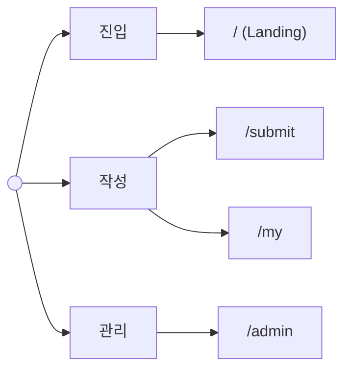
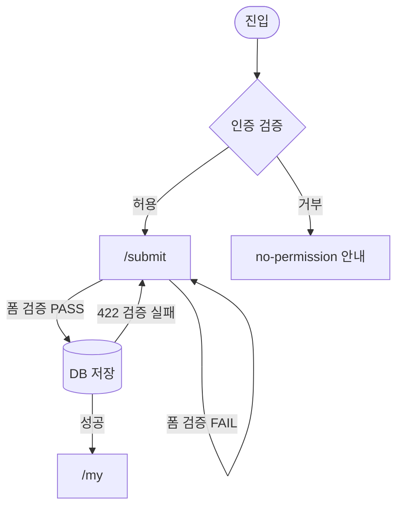

# Screen Spec Skill

`/screen-spec` 명령어의 실행 엔진. PRD를 읽어 화면정의서 5종을 생성한다.

## 핵심 원칙

- **PRD 단일 진실원**: Role Key, FR ID, 페이지 Route, 상태 매트릭스는 모두 PRD에서 인용. 추측 금지
- **순차 의존**: IA → User Flow → Screen Spec → Wireframe → Dev Handoff. 이전 단계 누락 시 stop
- **로파이 와이어프레임**: 흑백 + 의미색(빨강=error, 초록=success, 노랑=warning, 회색=중립)만 사용. 컬러/타이포/브랜드 결정은 다음 단계(mockup/`/implement` 직전 스타일 선택)에서 다룸
- **wigtn-coding 자산 활용**: frontend-developer (리뷰)와 통합
- **차단보다 보강**: 입력 부족 시 사용자에게 명확한 보완 지시를 주고 stop

## 입력 / 출력

### 입력
- `docs/prd/PRD_<feature>.md` (필수)
- 옵션: `--interview` (디테일 보강 Q&A), `--platform=web|mobile` (기본 web), `--pages=<list>`

### 출력 디렉토리: `docs/prd/screens/<feature>/`

```
docs/prd/screens/<feature>/
├── 01-IA.md            # 정보구조도 (Mermaid flowchart LR + 매핑 테이블)
├── 02-USER-FLOW.md     # 상세 플로우 (분기 조건 명시)
├── 03-SCREEN-SPEC.md   # 화면별 명세 (Audience/Auth/States/Components/Microcopy/Responsive)
├── 04-WIREFRAME.html   # 단일 HTML, Tailwind CDN, anchor 네비, 흑백+의미색만
└── 05-DEV-HANDOFF.md   # FR ↔ 화면 ↔ 컴포넌트 매핑, /implement 입력
```

## 워크플로우

```
LOAD → [INTERVIEW?] → GENERATE × 5 → REVIEW → HANDOFF
```

`--interview` 플래그가 주어지면 LOAD 직후 단일 턴 배치 질문 단계가 들어간다. 기본은 PRD 추론 모드.

### Phase 1: LOAD (PRD 파싱)

1. `docs/prd/PRD_<feature>.md` Read
2. 추출 항목:
   ```yaml
   roles: [author, admin]                    # §2.3
   pages:                                     # §5.4 (Has FE Components: Yes만)
     - route: /
       audience: [guest, author]
       auth: optional
       linked_frs: [FR-001]
       primary_state: success
       responsive: [Desktop, Mobile]
   page_states:                               # §5.4.1
     /: [loading, error, success]
     /submit: [loading, error, success, no-permission]
   user_flow: <Mermaid source>                # §5.5
   functional_requirements:                   # §3
     FR-001: {요약}
     FR-002: {요약}
   ```
3. 검증 게이트:
   - FE 페이지 0개 → "백엔드 전용 PRD. /implement로 진행" 안내 후 stop
   - §5.4.1 누락 → "Page State Matrix가 필요합니다" 안내 후 stop
   - §5.5 누락 → "User Flow가 필요합니다" 안내 후 stop
4. 플랫폼 감지 및 자동 전환:
   - `--platform` 명시값이 있으면 그 값을 그대로 사용 (사용자 의도 우선)
   - 미지정 + §1 Overview에 **모바일 시그널** 감지 → **자동으로 `mobile` 모드 전환**. "모바일 PRD로 판단되어 `--platform=mobile`로 진행합니다. 웹으로 강제하려면 `--platform=web`을 명시하세요." 안내 출력
     - 시그널: `React Native`, `RN`, `iOS`, `Android`, `네이티브`, `앱스토어`, `모바일 앱`, `mobile`
     - ⚠️ 단독 `앱`은 시그널로 쓰지 않는다 — `웹앱`/`web app`에 부분 매칭되어 오탐. `웹앱`만 있으면 `web`
   - 미지정 + 시그널 없음 → 기본 `web`

### Phase 2: INTERVIEW (선택, `--interview` 플래그 시에만)

PRD가 못 다루는 화면 레이어 의사결정을 끌어낸다. **단일 메시지에 5~7개 객관식 질문을 번호 매겨 제시**한 뒤 사용자 1회 응답을 받는다(라운드트립 1회로 끝나도록 절대 분할하지 말 것).

질문 셋(샘플):
1. 네비게이션 패턴 — top / side / bottom / drawer
2. 정보 밀도 — compact (정보 우선) / spacious (가독성 우선)
3. 에러 톤 — 공식적 / 친근한
4. 빈 상태 철학 — 일러스트 + CTA / 최소 텍스트 + CTA
5. 전환 방식 — page / modal / drawer
6. 모바일 우선순위 — desktop-first / mobile-first / parity
7. 핵심 후크(첫 화면) 방향 — value-first / action-first / story-first

응답을 받으면 03-SCREEN-SPEC.md 작성 시 명시적으로 반영.

플래그가 없으면 이 Phase 건너뜀(추론 모드). PRD에 `TBD` / `???` / 빈 셀이 5건 이상이면 종료 안내에 `--interview` 재실행을 추천한다.

### Phase 3: GENERATE (산출물 5종 순차 생성)

각 산출물은 `templates/` 보일러플레이트를 기반으로 PRD 데이터를 주입.

**실행 분기 (토큰 최적화)**:
- **3.1~3.3 (IA, User Flow, Screen Spec)**: 메인 스레드에서 직접 생성. 짧고 구조적이며 후속 단계에서 참조 빈도가 높음.
- **3.4~3.5 (Wireframe HTML, Dev Handoff)**: **subagent로 분기 실행**. 가장 큰 출력이며 한 번 생성 후 재참조가 적어 메인 컨텍스트에 누적할 가치가 낮음. 호출 시 Agent 도구로 `general-purpose` subagent에 다음을 전달:
  - PRD 파일 경로
  - 01~03 산출물 파일 경로 (subagent가 재읽기)
  - 사용할 템플릿 경로 (플랫폼 분기 결과)
  - INTERVIEW 응답이 있다면 결정사항 요약
  - 출력 파일 경로
- subagent는 결과 파일 경로와 검증 요약만 메인 스레드로 반환. 본문 자체는 메인 컨텍스트에 누적시키지 않음.
- prompt caching 활용을 위해 PRD 읽기는 LOAD 단계에 고정 (5분 TTL 안에 후속 단계 마무리).

#### 3.1 `01-IA.md` (정보구조도)

Mermaid `flowchart LR` + 페이지×기능 매핑 테이블.



**규칙**:
- 1Depth ≤ 7개 (Miller's Law)
- 모든 페이지에 1+ FR 연결 강제
- 페이지-FR 매핑 테이블 필수
- mindmap은 사용 금지 (환경별 지원 편차) — `flowchart LR` 통일
- 라우트는 `["..."]`로 감싸 파서 안전성 확보

#### 3.2 `02-USER-FLOW.md` (사용자 플로우)

PRD §5.5의 Mermaid를 **분기 조건까지 명시**하여 확장.



> **Mermaid 안전 룰**: 라우트(`/`)나 특수문자(`?`, `=`, `:`, `()`)가 포함된 노드 텍스트는 **항상 `["..."]` 큰따옴표로 감싼다**. shape는 valid한 것만 사용 — 직사각형 `[]`, 둥근 `()`, 원 `(())`, 다이아몬드 `{}`, 실린더 `[(...)]`, 비대칭/사다리꼴 `[/.../]`. `{(...)}`는 존재하지 않는다.

**규칙**:
- 시나리오 1개당 플로우 1개 권장 (Acceptance Criteria 매핑)
- 모든 페이지가 IA의 페이지와 매칭되어야 함
- 분기 노드(`{}`)에 조건 라벨 필수

#### 3.3 `03-SCREEN-SPEC.md` (화면별 명세)

페이지 1개당 1섹션. 다음 7개 슬롯 강제:

```markdown
## Screen: {route}

| 항목 | 값 |
|---|---|
| Audience | {role-key} |
| Auth | {Required 또는 Optional} ({인증 방식}) |
| Linked FRs | {FR-list} |
| Layout | {레이아웃 요약} |
| Responsive | {분기 표기} |

### States
- [x] loading: {처리}
- [ ] empty: N/A 또는 {CTA 포함 안내}
- [x] error: {inline 또는 상단 배너}
- [x] success: {전환 또는 토스트}
- [x] no-permission: {안내 또는 리다이렉트}

### Components
| Slot | Type | Required | Validation | Microcopy |
|---|---|---|---|---|
| {field} | {type} | Yes/No | {규칙} | "{라벨}" |
| submit | button | Yes | - | "{동사형}" |

### Microcopy
- 진입 안내: "{1~2줄 안내}"
- 에러: "{사용자 언어, 코드 노출 금지}"

### Responsive
- Desktop (≥1024px): {레이아웃 변화}
- Mobile (<768): {1열 또는 모달}

### Wireframe Anchor
→ `04-WIREFRAME.html#screen-{slug}`
```

**규칙**:
- §5.4.1의 체크된 상태마다 1줄 이상 명세 (`references/state-checklist.md` 참조)
- 모든 폼 필드에 validation + microcopy 둘 다 있어야 함
- Wireframe Anchor는 04-WIREFRAME.html의 `<section id="screen-<slug>">`와 일치

#### 3.4 `04-WIREFRAME.html` (단일 HTML 와이어프레임)

**한 파일**에 모든 페이지를 `<section>`으로 분할. 상단 anchor 네비게이션. **흑백 + 의미색만 사용**.

**플랫폼 분기**:
- `--platform=web` (기본) → `templates/04-WIREFRAME.html` 보일러플레이트 사용. Desktop ≥1024 / Tablet 768~1023 / Mobile <768 분기점.
- `--platform=mobile` → `templates/04-WIREFRAME-mobile.html` 사용. iPhone 15 (393×852) / SE (375×667) 프레임, Stack/Tab/Drawer 네비 패턴, safe area, bottom/action sheet 예시 포함.
- 미지정 + PRD §1 Overview에 모바일 시그널(`React Native`/`RN`/`iOS`/`Android`/`네이티브`/`앱스토어`/`모바일 앱`/`mobile`, **단독 `앱`·`웹앱`은 제외**) 감지 → LOAD 단계에서 **자동으로 mobile 모드로 전환**하고 사용자에게 안내. 사용자가 웹으로 강제하려면 `--platform=web`을 명시.

의미색 가이드:
- `bg-red-50` / `text-red-*` — error 상태
- `bg-green-50` / `text-green-*` — success 상태
- `bg-amber-50` / `text-amber-*` — warning / no-permission
- 그 외 모두 `neutral-*` (회색 계열)
- 브랜드/액센트 컬러 **금지** — 스타일 결정은 별도 단계로 분리

구조:
```html
<!DOCTYPE html>
<html lang="ko">
<head>
  <meta charset="UTF-8" />
  <meta name="viewport" content="width=device-width, initial-scale=1" />
  <title>화면정의서 — {feature}</title>
  <script src="https://cdn.tailwindcss.com"></script>
  <style>/* Wireframe = grayscale + semantic state colors only. */</style>
</head>
<body class="bg-neutral-50">
  <header class="sticky top-0 z-50 bg-white border-b">
    <nav class="max-w-5xl mx-auto px-4 py-3 flex gap-4">
      <a href="#screen-landing" class="text-sm">Landing</a>
      <a href="#screen-submit" class="text-sm">/submit</a>
      <a href="#screen-my" class="text-sm">/my</a>
      <a href="#screen-admin" class="text-sm">/admin</a>
    </nav>
  </header>

  <main class="max-w-5xl mx-auto px-4 py-8 space-y-16">
    <section id="screen-landing" class="border rounded-lg p-6">
      <h2 class="text-xl font-semibold mb-4">Landing /</h2>
      <!-- 로파이 박스 + 라벨 -->
    </section>

    <section id="screen-submit" class="border rounded-lg p-6">
      <h2 class="text-xl font-semibold mb-4">/submit</h2>
      <!-- Desktop 뷰 -->
      <div class="border-2 border-dashed border-neutral-300 p-6 mb-4">
        <p class="text-xs text-neutral-500 mb-2">Desktop ≥1024px</p>
        <!-- 좌: 폼 / 우: reference Q&A -->
      </div>
      <!-- Mobile 뷰 -->
      <div class="border-2 border-dashed border-neutral-300 p-6 max-w-sm">
        <p class="text-xs text-neutral-500 mb-2">Mobile &lt;768px</p>
        <!-- 1열 -->
      </div>
    </section>
  </main>
</body>
</html>
```

**규칙**:
- 회색 박스(`border-2 border-dashed`) + 라벨로 표현
- 실제 콘텐츠 디자인 X (텍스트 위주, 이미지 placeholder만)
- 페이지 수 ≥6개 또는 생성된 산출물이 600줄 초과 시 `04-wireframes/<page-slug>.html` 분할 + `04-WIREFRAME.html`은 인덱스
- 페이지 간 이동은 `<a href="#screen-<slug>">` anchor 링크 (클릭 가능 프로토타입)
- 모바일 reference 템플릿(`04-WIREFRAME-mobile.html`)은 네비 패턴 3종을 보여주기 위해 더 길 수 있으며, 실제 생성 시에는 사용하지 않는 패턴 섹션을 제거할 것

#### 3.5 `05-DEV-HANDOFF.md` (개발 인계)

`/implement`가 task로 분해할 수 있도록 매핑.

```markdown
## FR ↔ Screen ↔ Component Mapping

| FR | Screen | Components | Estimated Tasks |
|----|--------|------------|----------------|
| FR-001 {요약} | {route-list} | {Component-list} | {sub-task-list} |
| FR-002 {요약} | {route} | {Component-list} | {sub-task-list} |
| FR-003 {요약} | {route} | {Component-list} | {sub-task-list} |

## Reusable Component Inventory
- {ReusableComponent-1}
- {ReusableComponent-2}

## Open Questions for Implementation
- [ ] {결정 보류 항목 1}
- [ ] {결정 보류 항목 2}
- [ ] {라이브러리 선택 결정 보류}
```

**규칙**:
- 모든 FR이 1+ Screen에 매핑 (역도 성립)
- Estimated Tasks는 `/implement`의 sub-task로 직접 변환됨
- Open Questions는 명세에서 빠진 항목 (선택 가능)

### Phase 4: REVIEW (frontend-developer 자동 리뷰, 필수)

`wigtn-coding:frontend-developer` 에이전트를 호출하여 산출물을 검증한다.

**전달 입력**:
- 산출물 디렉토리 경로 `docs/prd/screens/<feature>/`
- 점검 체크리스트 (`references/handoff-checklist.md` 그대로):
  - a11y — landmark, label, aria-* 누락 없음
  - Responsive — 모든 페이지에 적절한 분기점 (web: ≥1024/<768, mobile: 393/375)
  - AI 냄새 — 클리셰 카피, 보라색 그라데이션 등 wireframe에 부적절한 디자인 요소 없음
  - Microcopy — §5.4.1 체크된 모든 상태에 카피 존재
  - Component — 모든 폼 필드에 validation + microcopy
- INTERVIEW 응답이 있다면 그 결정사항(네비/밀도/톤 등)이 일관되게 반영되었는지 확인

**반환 형식**: `PASS | WARN(개수) | FAIL(critical 개수, 항목 리스트)` — 자세한 출력 스키마는 `references/handoff-checklist.md` "Output Format" 섹션 참조.

**결과 처리** (구간 연속, 공백 없음):
- PASS → 진행
- WARN 1~3건 → 경고만 표시하고 진행
- WARN 4~7건 → 경고 표시 후 사용자에게 부분 재생성 여부 확인
- FAIL (critical ≥1건 또는 WARN ≥8건) → 해당 섹션(03-SCREEN-SPEC.md 또는 04-WIREFRAME.html)만 재생성

리뷰는 **건너뛸 수 없는 품질 게이트**다. 시간이 부족해도 PASS/WARN 결과를 받지 않은 채 Phase 5로 진행하지 않는다.

### Phase 5: HANDOFF (다음 단계 안내)

screen-spec.md (commands/) 의 Phase 5 가이드 출력.

## 트리거 패턴별 동작

| 사용자 입력 | 실행 |
|---|---|
| `/screen-spec <feature>` | 전체 워크플로우 (추론 모드, web) |
| `/screen-spec <feature> --interview` | LOAD 후 Q&A 단계 추가 |
| `/screen-spec <feature> --platform=mobile` | 모바일 템플릿으로 분기 |
| `/screen-spec <feature> --pages=/a,/b` | Phase 3에서 지정 페이지만 |
| "와이어프레임만 다시 만들어" | Phase 3.4만 재실행 (해당 파일만 덮어쓰기, 나머지 보존) |
| "FR-003 매핑이 빠졌어" | Phase 3.5만 재실행 |

**재실행 머지 정책**: 부분 재생성 시 지정된 파일만 전체 덮어쓰기, 다른 산출물은 보존. diff 머지는 하지 않음.

## 안티패턴

- PRD 없이 실행하지 않는다 (입력 부족 → 추측 → 거짓 명세)
- 5개 산출물을 하나의 거대 파일에 합치지 않는다 (검토 불가)
- 와이어프레임에 브랜드/액센트 컬러를 넣지 않는다 (흑백 + 의미색 원칙)
- 와이어프레임에 실제 콘텐츠 디자인(폰트, 그림자, 그라데이션)을 넣지 않는다
- frontend-developer 리뷰를 건너뛰지 않는다 (필수 품질 게이트)
- §5.4.1 체크된 상태를 명세에서 누락하지 않는다 (Single Source of Truth)
- INTERVIEW 질문을 한 개씩 분할 전송하지 않는다 (라운드트립 폭증 → 토큰 낭비)

## 참고 문서

- `templates/01-IA.md`
- `templates/02-USER-FLOW.md`
- `templates/03-SCREEN-SPEC.md`
- `templates/04-WIREFRAME.html` — 웹 (기본)
- `templates/04-WIREFRAME-mobile.html` — 모바일 (`--platform=mobile`)
- `templates/05-DEV-HANDOFF.md`
- `references/state-checklist.md` — 페이지 상태별 체크리스트
- `references/microcopy-patterns.md` — 자주 쓰는 마이크로카피 패턴
- `references/handoff-checklist.md` — frontend-developer 리뷰 체크리스트

## 기존 wigtn-coding 자산과의 관계

| 자산 | 관계 |
|---|---|
| `commands/prd.md` | screen-spec은 PRD §2.3/§5.4/§5.4.1/§5.5를 입력으로 받음 |
| `agents/prd-reviewer.md` | prd-reviewer가 §5.4.1·§5.5 누락을 막아주면 입력이 안정됨 |
| `agents/frontend-developer.md` | Phase 4에서 자동 리뷰 (필수 품질 게이트) |
| `agents/design-discovery.md` | screen-spec **밖**의 별도 단계로 분리됨. mockup/스타일 결정은 `/implement` 직전 또는 별도 명령으로 호출 |
| `skills/design-system-reference/` | screen-spec에선 사용 안 함. mockup/구현 단계에서 참조 |
| `commands/implement.md` | screen-spec 산출물을 입력으로 받아 task 분해 |
