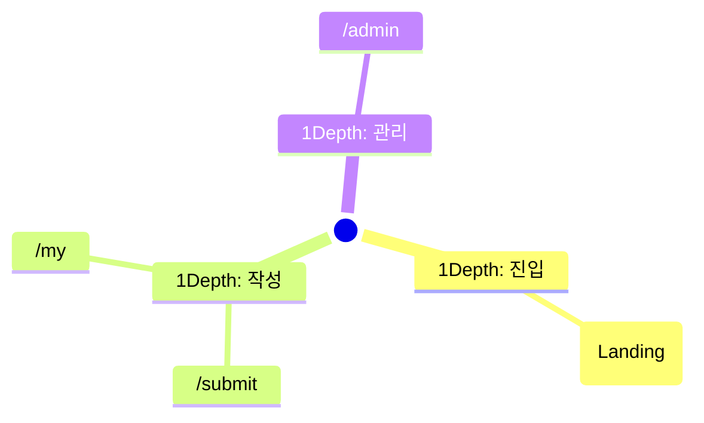

# Screen Spec Skill

`/screen-spec` 명령어의 실행 엔진. PRD를 읽어 화면정의서 5종을 생성한다.

## 핵심 원칙

- **PRD 단일 진실원**: Role Key, FR ID, 페이지 Route, 상태 매트릭스는 모두 PRD에서 인용. 추측 금지
- **순차 의존**: IA → User Flow → Screen Spec → Wireframe → Dev Handoff. 이전 단계 누락 시 stop
- **로파이 와이어프레임**: 픽셀 정밀 디자인이 아닌 레이아웃 + 컴포넌트 배치 검증용
- **wigtn-coding 자산 활용**: design-discovery (스타일), frontend-developer (리뷰)와 통합
- **차단보다 보강**: 입력 부족 시 사용자에게 명확한 보완 지시를 주고 stop

## 입력 / 출력

### 입력
- `docs/prd/PRD_<feature>.md` (필수)
- 옵션: `--style=<name>`, `--skip-style`, `--pages=<list>`

### 출력 디렉토리: `docs/prd/screens/<feature>/`

```
docs/prd/screens/<feature>/
├── 01-IA.md            # 정보구조도 (Mermaid mindmap + 매핑 테이블)
├── 02-USER-FLOW.md     # 상세 플로우 (분기 조건 명시)
├── 03-SCREEN-SPEC.md   # 화면별 명세 (Audience/Auth/States/Components/Microcopy/Responsive)
├── 04-WIREFRAME.html   # 단일 HTML, Tailwind CDN, anchor 네비, 선택 스타일 반영
└── 05-DEV-HANDOFF.md   # FR ↔ 화면 ↔ 컴포넌트 매핑, /implement 입력
```

## 5-Phase 워크플로우

```
LOAD → STYLE → GENERATE × 5 → REVIEW → HANDOFF
```

### Phase 1: LOAD (PRD 파싱)

1. `docs/prd/PRD_<feature>.md` Read
2. 추출 항목:
   ```yaml
   roles: [author, admin]                    # §2.3
   pages:                                     # §5.4 (Has FE Components: Yes만)
     - route: /
       audience: [guest, author]
       auth: optional
       linked_frs: [FR-001]
       primary_state: success
       responsive: [Desktop, Mobile]
   page_states:                               # §5.4.1
     /: [loading, error, success]
     /submit: [loading, error, success, no-permission]
   user_flow: <Mermaid source>                # §5.5
   functional_requirements:                   # §3
     FR-001: Magic Link 인증
     FR-002: /submit 폼
   ```
3. 검증 게이트:
   - FE 페이지 0개 → "백엔드 전용 PRD. /implement로 진행" 안내 후 stop
   - §5.4.1 누락 → "Page State Matrix가 필요합니다" 안내 후 stop
   - §5.5 누락 → "User Flow가 필요합니다" 안내 후 stop

### Phase 2: STYLE (디자인 스타일 선택)

`--skip-style` 미지정 시 design-discovery 호출.

```python
result = Agent(
    subagent_type="wigtn-coding:design-discovery",
    prompt=f"""
    PRD: {PRD_path}
    Task: Recommend 3 design styles for these screens with suitability %.
    Context:
      - Product: {prd.overview}
      - User: {prd.primary_user}
      - Pages: {prd.pages}
    Return: style_key + rationale + suitability_pct for top 3.
    """
)
```

사용자 선택 → `<style_key>` 저장. 이후 Wireframe 생성 시 해당 스타일의 토큰 참조:
- `plugins/wigtn-coding/skills/design-system-reference/styles/<style_key>.md`

### Phase 3: GENERATE (산출물 5종 순차 생성)

각 산출물은 `templates/` 보일러플레이트를 기반으로 PRD 데이터를 주입.

#### 3.1 `01-IA.md` (정보구조도)

Mermaid mindmap + 페이지×기능 매핑 테이블.



**규칙**:
- 1Depth ≤ 7개 (Miller's Law)
- 모든 페이지에 1+ FR 연결 강제
- 페이지-FR 매핑 테이블 필수

#### 3.2 `02-USER-FLOW.md` (사용자 플로우)

PRD §5.5의 Mermaid를 **분기 조건까지 명시**하여 확장.

```mermaid
flowchart TD
  Start([진입]) --> Auth{Magic Link 검증}
  Auth -->|domain 화이트리스트 OK| Submit[/submit]
  Auth -->|domain 거부| NoPerm[no-permission 안내]
  Submit -->|폼 검증 PASS| Save{(DB 저장)}
  Submit -->|폼 검증 FAIL| Submit
  Save -->|성공| MyList[/my]
  Save -->|422 SENSITIVE_DATA| Submit
```

**규칙**:
- 시나리오 1개당 플로우 1개 권장 (Acceptance Criteria 매핑)
- 모든 페이지가 IA의 페이지와 매칭되어야 함
- 분기 노드(`{}`)에 조건 라벨 필수

#### 3.3 `03-SCREEN-SPEC.md` (화면별 명세)

페이지 1개당 1섹션. 다음 7개 슬롯 강제:

```markdown
## Screen: /submit

| 항목 | 값 |
|---|---|
| Audience | author |
| Auth | Required (Magic Link) |
| Linked FRs | FR-002, FR-003, FR-004 |
| Layout | Single column form, max-width 720px |
| Responsive | Desktop / Tablet / Mobile |

### States
- [x] loading: Magic Link 검증 중 스피너
- [ ] empty: N/A
- [x] error: 422 SENSITIVE_DATA → 빨간 배너
- [x] success: 제출 후 /my로 리다이렉트 + 토스트
- [x] no-permission: 도메인 화이트리스트 외 → 안내 페이지

### Components
| Slot | Type | Required | Validation | Microcopy |
|---|---|---|---|---|
| question_type | radio | Yes | enum [general,faq] | "FAQ: 월 5건 이상 반복" |
| answer_points | dynamic-textarea[] | Yes | ≥3 bullet | "100% 완벽한 정답일 필요 X" |
| source_pages | tag-input | Yes | int[] ≥1 | "쉼표/엔터로 구분: 4, 15, 41" |

### Microcopy
- 진입 안내: "골든셋 작성에 평균 10분 소요됩니다"
- 제출 버튼: "제출하기"
- 에러: "민감 정보(이메일/URL/API 키)가 포함된 것 같습니다"

### Responsive
- Desktop (≥1024px): 2열 (좌: 폼 / 우: reference Q&A 4건)
- Tablet (768-1023): 1열, reference Q&A 상단 접힘
- Mobile (<768): 1열, reference Q&A는 모달

### Wireframe Anchor
→ `04-WIREFRAME.html#screen-submit`
```

**규칙**:
- §5.4.1의 체크된 상태마다 1줄 이상 명세 (`references/state-checklist.md` 참조)
- 모든 폼 필드에 validation + microcopy 둘 다 있어야 함
- Wireframe Anchor는 04-WIREFRAME.html의 `<section id="screen-<slug>">`와 일치

#### 3.4 `04-WIREFRAME.html` (단일 HTML 와이어프레임)

**한 파일**에 모든 페이지를 `<section>`으로 분할. 상단 anchor 네비게이션.

구조:
```html
<!DOCTYPE html>
<html lang="ko">
<head>
  <meta charset="UTF-8" />
  <meta name="viewport" content="width=device-width, initial-scale=1" />
  <title>화면정의서 — {feature}</title>
  <script src="https://cdn.tailwindcss.com"></script>
  <style>/* 선택 스타일의 토큰 주입 (color, font, shadow) */</style>
</head>
<body class="bg-neutral-50">
  <header class="sticky top-0 z-50 bg-white border-b">
    <nav class="max-w-5xl mx-auto px-4 py-3 flex gap-4">
      <a href="#screen-landing" class="text-sm">Landing</a>
      <a href="#screen-submit" class="text-sm">/submit</a>
      <a href="#screen-my" class="text-sm">/my</a>
      <a href="#screen-admin" class="text-sm">/admin</a>
    </nav>
  </header>

  <main class="max-w-5xl mx-auto px-4 py-8 space-y-16">
    <section id="screen-landing" class="border rounded-lg p-6">
      <h2 class="text-xl font-semibold mb-4">Landing /</h2>
      <!-- 로파이 박스 + 라벨 -->
    </section>

    <section id="screen-submit" class="border rounded-lg p-6">
      <h2 class="text-xl font-semibold mb-4">/submit</h2>
      <!-- Desktop 뷰 -->
      <div class="border-2 border-dashed border-neutral-300 p-6 mb-4">
        <p class="text-xs text-neutral-500 mb-2">Desktop ≥1024px</p>
        <!-- 좌: 폼 / 우: reference Q&A -->
      </div>
      <!-- Mobile 뷰 -->
      <div class="border-2 border-dashed border-neutral-300 p-6 max-w-sm">
        <p class="text-xs text-neutral-500 mb-2">Mobile &lt;768px</p>
        <!-- 1열 -->
      </div>
    </section>
  </main>
</body>
</html>
```

**규칙**:
- 회색 박스(`border-2 border-dashed`) + 라벨로 표현
- 실제 콘텐츠 디자인 X (텍스트 위주, 이미지 placeholder만)
- 페이지 수 ≥6개면 `04-wireframes/<page-slug>.html` 분할 + `04-WIREFRAME.html`은 인덱스
- 페이지 간 이동은 `<a href="#screen-<slug>">` anchor 링크 (클릭 가능 프로토타입)
- 200줄 초과 시 분할 권장

#### 3.5 `05-DEV-HANDOFF.md` (개발 인계)

`/implement`가 task로 분해할 수 있도록 매핑.

```markdown
## FR ↔ Screen ↔ Component Mapping

| FR | Screen | Components | Estimated Tasks |
|----|--------|------------|----------------|
| FR-001 Magic Link | /, /submit (auth gate) | LoginForm | 1. Supabase Auth 연동 / 2. 도메인 화이트리스트 검증 |
| FR-002 Submit 폼 | /submit | GoldenSetForm, FieldDynamic | 1. 폼 컴포넌트 / 2. 동적 bullet 추가 / 3. 폼 검증 |
| FR-006 Admin 화면 | /admin | AdminTable, FilterBar, ExportButton | 1. 테이블 / 2. 필터 / 3. 익스포트 모달 |

## Reusable Component Inventory
- LoginForm
- GoldenSetForm
- FieldDynamic (배열 입력)
- AdminTable

## Open Questions for Implementation
- [ ] 폼 자동 저장 주기 (지금은 명시 없음)
- [ ] /admin 페이지의 페이지네이션 vs 무한 스크롤
- [ ] Toast 라이브러리 선택 (sonner / react-hot-toast / custom)
```

**규칙**:
- 모든 FR이 1+ Screen에 매핑 (역도 성립)
- Estimated Tasks는 `/implement`의 sub-task로 직접 변환됨
- Open Questions는 명세에서 빠진 항목 (선택 가능)

### Phase 4: REVIEW (frontend-developer 자동 리뷰)

```python
result = Agent(
    subagent_type="wigtn-coding:frontend-developer",
    prompt=f"""
    Review screen-spec artifacts at docs/prd/screens/{feature}/.
    Checklist (references/handoff-checklist.md):
      - a11y: landmark, label, aria-* 누락 없음
      - Responsive: 모든 페이지에 모바일 분기점
      - AI smell: 클리셰 카피, 보랏빛 그라데이션 남발 없음
      - Microcopy: §5.4.1 체크된 모든 상태에 카피 존재
      - Component: 모든 폼 필드에 validation + microcopy
    Return: PASS / WARN(count) / FAIL(critical_count, items)
    """
)
```

결과 처리:
- PASS / WARN(≤3) → 진행
- FAIL → 03-SCREEN-SPEC.md 또는 04-WIREFRAME.html 부분 재생성

### Phase 5: HANDOFF (다음 단계 안내)

screen-spec.md (commands/) 의 Phase 5 가이드 출력.

## 트리거 패턴별 동작

| 사용자 입력 | 실행 |
|---|---|
| `/screen-spec <feature>` | 전체 5-Phase |
| `/screen-spec <feature> --skip-style` | Phase 2 생략 (로파이 회색 박스) |
| `/screen-spec <feature> --pages=/a,/b` | Phase 3에서 지정 페이지만 |
| "와이어프레임만 다시 만들어" | Phase 3.4만 재실행 |
| "FR-003 매핑이 빠졌어" | Phase 3.5만 재실행 |

## 안티패턴

- PRD 없이 실행하지 않는다 (입력 부족 → 추측 → 거짓 명세)
- 5개 산출물을 하나의 거대 파일에 합치지 않는다 (검토 불가)
- 와이어프레임에 실제 디자인을 넣지 않는다 (로파이 원칙)
- design-discovery를 PRD가 백엔드 전용일 때 호출하지 않는다 (낭비)
- frontend-developer 리뷰를 건너뛰지 않는다 (품질 게이트)
- §5.4.1 체크된 상태를 명세에서 누락하지 않는다 (Single Source of Truth)

## 참고 문서

- `templates/01-IA.md`
- `templates/02-USER-FLOW.md`
- `templates/03-SCREEN-SPEC.md`
- `templates/04-WIREFRAME.html`
- `templates/05-DEV-HANDOFF.md`
- `references/state-checklist.md` — 페이지 상태별 체크리스트
- `references/microcopy-patterns.md` — 자주 쓰는 마이크로카피 패턴
- `references/handoff-checklist.md` — frontend-developer 리뷰 체크리스트

## 기존 wigtn-coding 자산과의 관계

| 자산 | 관계 |
|---|---|
| `commands/prd.md` | screen-spec은 PRD §2.3/§5.4/§5.4.1/§5.5를 입력으로 받음 |
| `agents/prd-reviewer.md` | prd-reviewer가 §5.4.1·§5.5 누락을 막아주면 입력이 안정됨 |
| `agents/design-discovery.md` | Phase 2에서 스타일 추천 받음 (VS 기법) |
| `agents/frontend-developer.md` | Phase 4에서 자동 리뷰 |
| `skills/design-system-reference/` | 선택된 스타일의 토큰(컬러/타이포) 참조 |
| `commands/implement.md` | screen-spec 산출물을 입력으로 받아 task 분해 |
