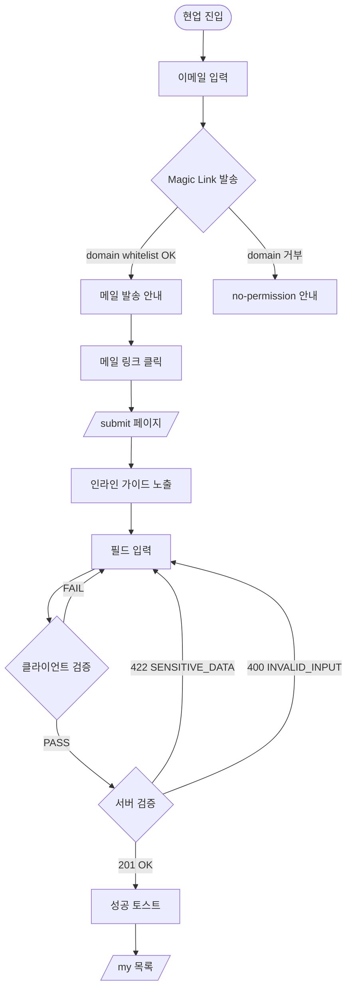
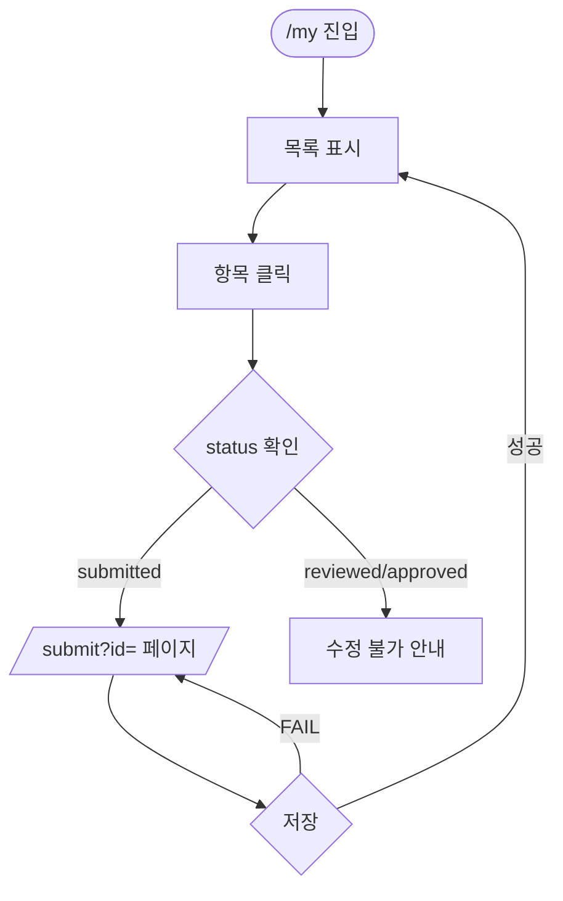

# User Flow — {feature-name}

> **Generated from**: docs/prd/PRD_{feature-name}.md §5.5
> **Created**: {YYYY-MM-DD}
> **Status**: Draft

## Flow A: 작성자 — 신규 골든셋 제출

> Acceptance Criteria 매핑: Scenario A, B, E



## Flow B: 작성자 — 본인 항목 수정

> Acceptance Criteria 매핑: Scenario D



## Flow C: PM — 익스포트

> Acceptance Criteria 매핑: Scenario C

```mermaid
flowchart TD
  Start([/admin 진입]) --> CheckRole{admin role?}
  CheckRole -->|No| Redirect[/ 로 리다이렉트]
  CheckRole -->|Yes| List[전체 목록]
  List --> Filter[상태=approved 필터]
  Filter --> ExportBtn[JSON Export 클릭]
  ExportBtn --> Modal[익명화 옵션 모달]
  Modal --> Download((JSON 다운로드))
```

## Flow Coverage Check

| Acceptance Criteria | Flow |
|--------------------|------|
| Scenario A | Flow A |
| Scenario B | Flow A (Guide 노드) |
| Scenario C | Flow C |
| Scenario D | Flow B |
| Scenario E | Flow A (Guide 노드) |

**규칙**:
- 모든 Acceptance Criteria가 1+ Flow에 매핑되어야 함
- 매핑되지 않는 시나리오 → Flow를 추가하거나 시나리오가 모호

## Branch Conditions Reference

| 분기 노드 | 조건 | 처리 |
|----------|------|------|
| Magic Link 발송 | `email.domain in whitelist` | OK / no-permission |
| 클라이언트 검증 | `question.length >= 10 && answer_points.length >= 3 && source_pages.length >= 1` | PASS / FAIL |
| 서버 검증 | 민감 정보 정규식 매치 | 422 / 400 / 201 |
| status 확인 | `status in ['draft', 'submitted']` | 수정 가능 / 잠금 |
| admin role | `user.role === 'admin'` | 허용 / 리다이렉트 |

## Open Questions

- [ ] Magic Link 만료 시 흐름이 어디서 분기되는가?
- [ ] 폼 입력 중 자동 저장은 별도 Flow인가?
