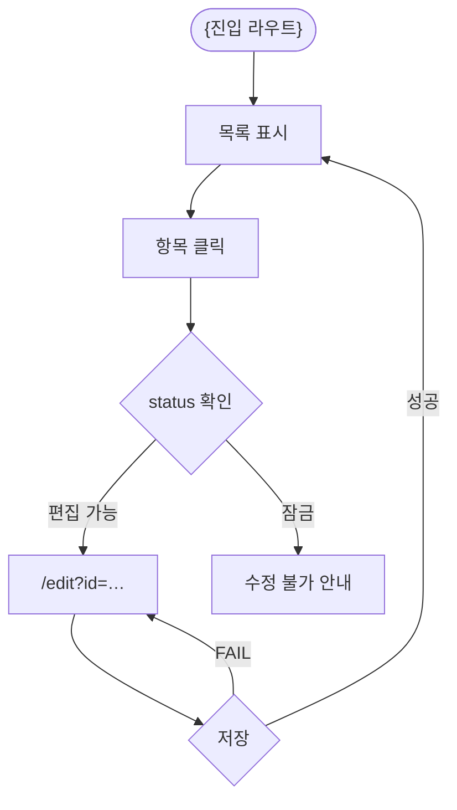
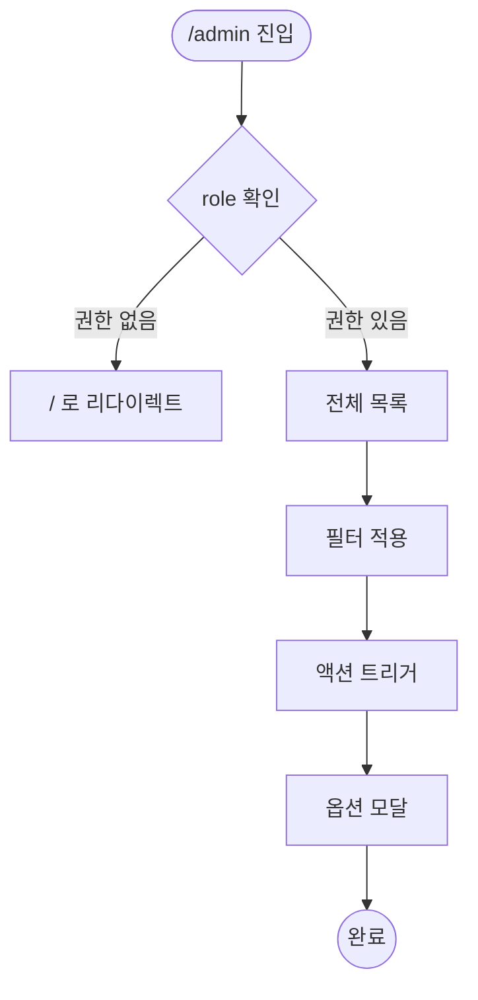

# User Flow — {feature-name}

> **Generated from**: docs/prd/PRD_{feature-name}.md §5.5
> **Created**: {YYYY-MM-DD}
> **Status**: Draft

> **Mermaid 룰**: 라우트(`/`)/특수문자(`?`, `=`, `:`)를 포함하는 노드 텍스트는 항상 `["..."]` 큰따옴표로 감싼다. valid한 shape만 사용: `[]` `()` `(())` `{}` `[(...)]`. `{(...)}`는 존재하지 않는다.

## Flow A: {role-1} — {primary-scenario}

> Acceptance Criteria 매핑: Scenario {A}

```mermaid
flowchart TD
  Start([{진입점}]) --> Step1[{초기 화면 또는 액션}]
  Step1 --> Decide{인증 필요?}
  Decide -->|허용| Continue["/main-route"]
  Decide -->|거부| NoPerm[no-permission 안내]
  Continue --> Form[필드 입력]
  Form --> Validate{검증}
  Validate -->|FAIL| Form
  Validate -->|PASS| Server{서버 응답}
  Server -->|201 OK| Success[성공 토스트]
  Server -->|4xx| Form
  Success --> Next["/next-route"]
```

## Flow B: {role-1} — {secondary-scenario}

> Acceptance Criteria 매핑: Scenario {B}



## Flow C: {role-2} — {admin-scenario}

> Acceptance Criteria 매핑: Scenario {C}



## Flow Coverage Check

| Acceptance Criteria | Flow |
|--------------------|------|
| Scenario A | Flow A |
| Scenario B | Flow B |
| Scenario C | Flow C |

**규칙**:
- 모든 Acceptance Criteria가 1+ Flow에 매핑되어야 함
- 매핑되지 않는 시나리오 → Flow를 추가하거나 시나리오가 모호

## Branch Conditions Reference

| 분기 노드 | 조건 | 처리 |
|----------|------|------|
| 인증 검증 | `user.authenticated && role in allowed_roles` | 허용 / no-permission |
| 클라이언트 검증 | 필드별 validation rule | PASS / FAIL |
| 서버 응답 | HTTP status | 201 / 422 / 400 |
| 권한 확인 | `user.role === required_role` | 허용 / 리다이렉트 |

## Open Questions

- [ ] 인증 만료 시 어디서 분기되는가?
- [ ] 자동 저장은 별도 Flow인가?
